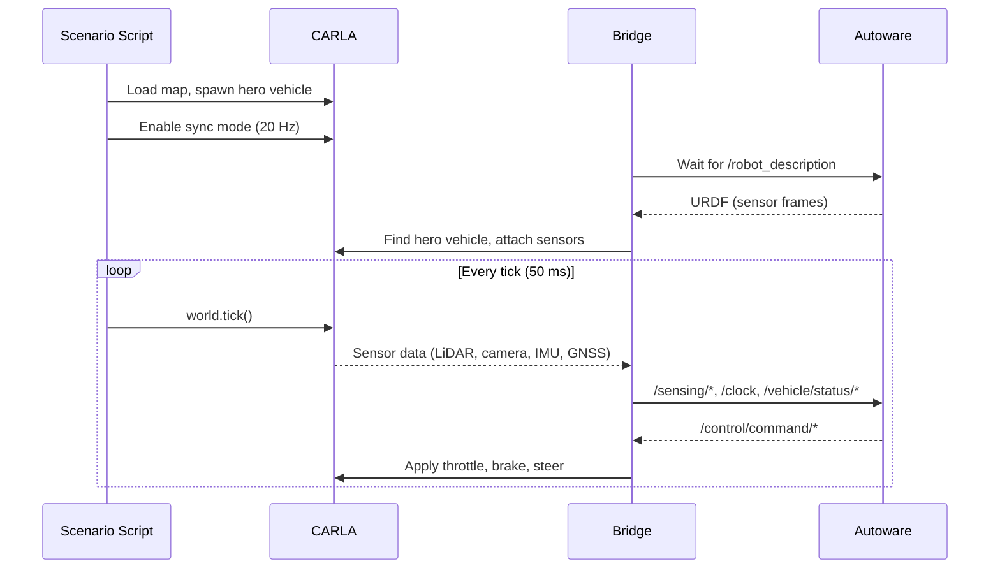

# Autoware CARLA Bridge

Native ROS 2 bridge between [CARLA](https://carla.org/) and [Autoware](https://autowarefoundation.github.io/autoware-documentation/). Written in Rust using [rclrs](https://github.com/ros2-rust/ros2_rust).

End-to-end autonomous driving works out of the box: start CARLA, launch the bridge, and the vehicle drives itself to a goal.

## Key Features

- **Single-process, native ROS 2** -- lightweight and performant; no multi-process coordination overhead
- **Autoware integration** -- auto-detects Autoware, reads sensor config from URDF/TF, publishes to standard Autoware topics
- **Automatic localization** -- GNSS auto-initializes Autoware's NDT localization pipeline; no manual pose estimation needed
- **Synchronous simulation** -- deterministic 20 Hz tick loop; bridge passively syncs with CARLA
- **Robust connections** -- infinite retry for both CARLA and Autoware with graceful Ctrl-C handling
- **Companion tools** -- vehicle monitor GUI, lanelet2/pointcloud map generators, pose capture utility

## Quick Start

### Prerequisites

- Ubuntu 22.04 + ROS 2 Humble
- [Autoware](https://autowarefoundation.github.io/autoware-documentation/) workspace built and sourceable
- [CARLA 0.9.16](https://carla.org/) installed and running
- CARLA Python API on `PYTHONPATH`
- [Map data](#map-data) downloaded

### Install

Download the latest release tarball from [GitHub Releases](https://github.com/NEWSLabNTU/autoware_carla_bridge/releases) and extract:

```bash
tar -xzf autoware-carla-bridge-0.12.0-x86_64.tar.gz
```

### Run

Start CARLA, then in another terminal:

```bash
source ~/autoware/install/setup.bash
source autoware-carla-bridge-0.12.0/setup.bash

ros2 launch acb_demo_launch single_vehicle_autoware.launch.xml \
    map_path:=/path/to/maps/Town01
```

This launches Autoware, the bridge, and a scenario that spawns a vehicle in Town01. The vehicle appears in RViz and is ready for manual or autonomous control.

### Running Components Separately

```bash
# Terminal 1: Autoware + bridge + monitor
ros2 launch acb_launch carla_simulator.launch.xml \
    map_path:=/path/to/maps/Town01

# Terminal 2: scenario script
ros2 launch acb_scenario single_vehicle_scenario.launch.xml

# Terminal 3 (optional): autonomous driving pilot
ros2 run acb_pilot auto_drive --ros-args \
    -p poses_file:=$(ros2 pkg prefix acb_pilot)/share/acb_pilot/config/poses/Town01.yaml
```

With the pilot, the vehicle auto-initializes localization via GNSS, follows a preset route, and drives to the goal.

### Map Data

Pre-converted Autoware maps (lanelet2 + PCD) for CARLA towns are available from [TUMFTM/carla-autoware-bridge](https://github.com/TUMFTM/carla-autoware-bridge). Each town directory contains:

```
Town01/
  lanelet2_map.osm
  pointcloud_map.pcd
  map_config.yaml
  map_projector_info.yaml
```

Available towns: Town01, Town02, Town03, Town05, Town10HD.

## Architecture



- **Scenario script** owns the CARLA world: loads map, spawns hero vehicle, runs the tick loop
- **Bridge** starts automatically as Autoware's vehicle interface; attaches sensors to the hero vehicle
- **One bridge per Autoware instance**; multi-vehicle via separate `ROS_DOMAIN_ID`

## Sensors

| Sensor | CARLA Blueprint         | ROS 2 Topic                     | Format                                    |
|--------|-------------------------|---------------------------------|-------------------------------------------|
| LiDAR  | `sensor.lidar.ray_cast` | `/sensing/lidar/top/pointcloud` | PointCloud2 (PointXYZIRC, NDT-compatible) |
| Camera | `sensor.camera.rgb`     | `/sensing/camera/*/image_raw`   | Image + CameraInfo                        |
| IMU    | `sensor.other.imu`      | `/sensing/imu/*/imu_raw`        | Imu                                       |
| GNSS   | `sensor.other.gnss`     | `/sensing/gnss/*/nav_sat_fix`   | NavSatFix                                 |

## Vehicle Interface

| Direction | Topic                             | Type                    |
|-----------|-----------------------------------|-------------------------|
| Status    | `/vehicle/status/velocity_status` | VelocityReport (~20 Hz) |
| Status    | `/vehicle/status/steering_status` | SteeringReport (~20 Hz) |
| Status    | `/vehicle/status/control_mode`    | ControlModeReport       |
| Status    | `/vehicle/status/gear_status`     | GearReport              |
| Control   | `/control/command/control_cmd`    | Control (subscribed)    |

## Configuration

**Sensor config**: `src/acb_bridge/config/vehicle_config.yaml`

**Autoware maps**: `data/carla-autoware-bridge/Town{01,02,03,05,10}/`

---

## Development

### Build from Source

Requires: Rust toolchain, [Just](https://github.com/casey/just), clang-13.

```bash
git clone <repo-url>
cd autoware_carla_bridge
git submodule update --init --recursive
just setup   # install deps, Autoware Debian, CARLA maps
just build
```

### Run with Just

```bash
# All-in-one (Autoware + bridge + scenario + monitor)
just carla-start
just sim

# With autonomous driving
just sim auto_drive=true

# Stop CARLA
just carla-stop
```

### Running Components Separately

```bash
just carla-start
just autoware    # Autoware + bridge + monitor (terminal 1)
just scenario    # scenario script (terminal 2)
just pilot       # autonomous driving pilot (terminal 3, optional)
```

### Other Recipes

```bash
just bridge         # bridge only (debugging)
just monitor        # vehicle monitor GUI
just capture-poses  # capture poses from RViz
just package        # build release tarball
```

### Environment

The `.envrc` file (auto-loaded by [direnv](https://direnv.net/)) sources the Autoware and local workspaces. Edit `.env` for machine-specific vars (GPU, display).

## Documentation

- [Sensor Configuration Strategy](docs/design/sensor-configuration-strategy.md)
- [Map Generation Guide](docs/guides/automated-map-generation.md)
- [Development Roadmap](docs/roadmap/)

## License

Apache-2.0
