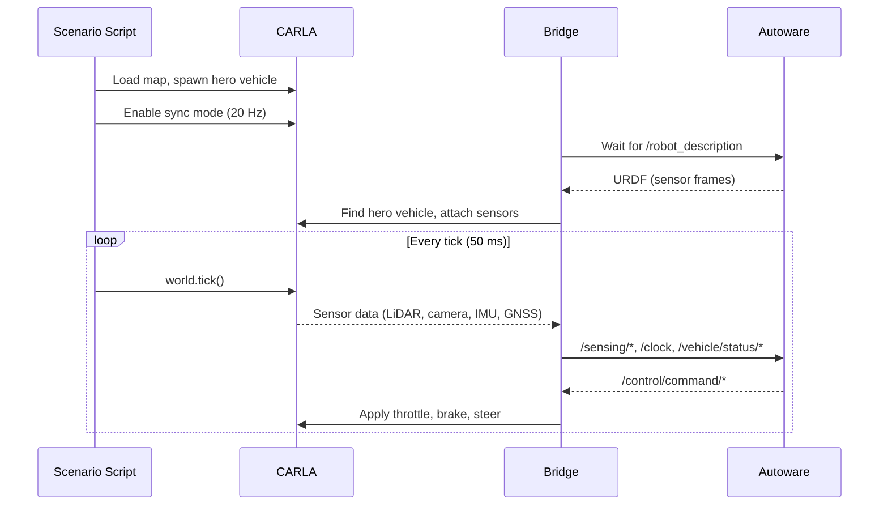

# Autoware CARLA Bridge

Native ROS 2 bridge between [CARLA](https://carla.org/) and [Autoware](https://autowarefoundation.github.io/autoware-documentation/). Written in Rust using [rclrs](https://github.com/ros2-rust/ros2_rust).

End-to-end autonomous driving works out of the box: start CARLA, run the demo, and the vehicle drives itself to a goal.

## Key Features

- **Single-process, native ROS 2** -- lightweight and performant; no multi-process coordination overhead
- **Autoware integration** -- auto-detects Autoware, reads sensor config from URDF/TF, publishes to standard Autoware topics
- **Automatic localization** -- GNSS auto-initializes Autoware's NDT localization pipeline; no manual pose estimation needed
- **Synchronous simulation** -- deterministic 20 Hz tick loop; bridge passively syncs with CARLA
- **Robust connections** -- infinite retry for both CARLA and Autoware with graceful Ctrl-C handling
- **Companion tools** -- vehicle monitor GUI, lanelet2/pointcloud map generators, pose capture utility

### Sensors

| Sensor | CARLA Blueprint         | ROS 2 Topic                     | Format                                    |
|--------|-------------------------|---------------------------------|-------------------------------------------|
| LiDAR  | `sensor.lidar.ray_cast` | `/sensing/lidar/top/pointcloud` | PointCloud2 (PointXYZIRC, NDT-compatible) |
| Camera | `sensor.camera.rgb`     | `/sensing/camera/*/image_raw`   | Image + CameraInfo                        |
| IMU    | `sensor.other.imu`      | `/sensing/imu/*/imu_raw`        | Imu                                       |
| GNSS   | `sensor.other.gnss`     | `/sensing/gnss/*/nav_sat_fix`   | NavSatFix                                 |

### Vehicle Interface

| Direction | Topic                             | Type                    |
|-----------|-----------------------------------|-------------------------|
| Status    | `/vehicle/status/velocity_status` | VelocityReport (~20 Hz) |
| Status    | `/vehicle/status/steering_status` | SteeringReport (~20 Hz) |
| Status    | `/vehicle/status/control_mode`    | ControlModeReport       |
| Status    | `/vehicle/status/gear_status`     | GearReport              |
| Control   | `/control/command/control_cmd`    | Control (subscribed)    |

## Quick Start

Requires: Ubuntu 22.04, ROS 2 Humble, [Autoware 1.5.0](https://autowarefoundation.github.io/autoware-documentation/), CARLA 0.9.16, Rust, [Just](https://github.com/casey/just).

```bash
# Build
just setup   # install deps, Autoware Debian, CARLA maps
just build

# Run (two terminals)
just carla-start   # start CARLA as background service
just run-demo      # start Autoware + bridge + scenario + auto-drive + monitor

# Or without autonomous driving (manual control via RViz)
just run-sim

# Stop
just carla-stop
```

The vehicle will:
1. Spawn in Town01
2. Auto-initialize localization via GNSS
3. Set a route and engage autonomous mode
4. Drive to the goal (~220 s)

## Configuration

**Sensor config**: `src/acb_bridge/config/vehicle_config.yaml`

**Autoware maps**: `data/carla-autoware-bridge/Town{01,02,03,05,10}/`

**CARLA settings**: edit `.env` for machine-specific vars (GPU, display)

**Environment**: `.envrc` (auto-loaded by [direnv](https://direnv.net/))

## Architecture



- **Scenario script** owns the CARLA world: loads map, spawns hero vehicle, runs the tick loop
- **Bridge** passively waits for ticks, reads sensor data, publishes to ROS 2, applies control commands
- **One bridge per Autoware instance**; multi-vehicle via separate `ROS_DOMAIN_ID`

## Documentation

- [Sensor Configuration Strategy](docs/design/sensor-configuration-strategy.md)
- [Map Generation Guide](docs/guides/automated-map-generation.md)
- [Development Roadmap](docs/roadmap/)

## License

Apache-2.0
